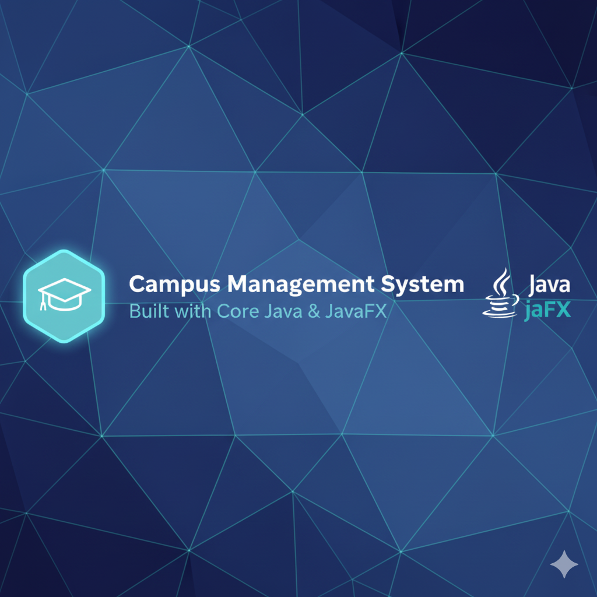

# 🎓 Campus Management System (Core Java Project)

<p align="center">
  
  
  
  
  
  
</p>

<p align="center">
  
  
</p>

---

## 🧭 Overview
A complete **Campus Management System** built using **Core Java (OOP, JDBC, JavaFX, Threads, Sockets, and RMI)** — designed to handle student, faculty, and admin operations efficiently.  
No frameworks, no shortcuts — everything coded manually using Java SE for learning and demonstration purposes.

---

## 🚀 Features

### 👤 Login System
- Role-based login (Admin / Student)
- Email + University ID + Password authentication
- Validations with custom exceptions

### 🎓 Student Module
- View personal profile & academic details  
- Enroll in courses  
- View grades & attendance  
- Download assignments / view submissions  
- Real-time chat with faculty or peers  

### 👩‍🏫 Faculty Module
- Manage courses and enrolled students  
- Add / update marks and attendance  
- Upload assignments or announcements  
- Chat with students and other faculty  

### 👑 Admin Module
- Full CRUD control on Students, Faculty, and Courses  
- Generate reports (Attendance, Grades, Assignments)  
- Manage system users and privileges  
- View application logs  

### 💬 Chat & Notification System
- Real-time messaging using Java Sockets  
- Background threads handle multiple connections  
- Notifications for new assignments or messages  


# Campus Management System

<p align="center">
  
</p>


A learning-focused Campus Management System implemented in Core Java. The project demonstrates common desktop application concepts including JDBC-based persistence, JavaFX UI, multithreading, socket-based chat, and RMI services. It was built without heavy frameworks to illustrate how the pieces work under the hood.

## Table of contents

- [Key features](#key-features)
- [Architecture & concepts](#architecture--concepts)
- [Tech stack](#tech-stack)
- [Project structure](#project-structure)
- [Prerequisites](#prerequisites)
- [Setup & run](#setup--run)
- [Configuration](#configuration)
- [Testing](#testing)
- [Contributing](#contributing)
- [License](#license)

## Key features

- Role-based authentication (Admin / Student)
- Student, Faculty and Admin modules (CRUD operations)
- Course enrollment, grade and attendance management
- Assignment upload/download
- Real-time chat using Java Sockets
- Remote services via RMI (grade/attendance retrieval)
- Exportable reports (CSV/text) and simple logging

## Architecture & concepts

This project is organized using modular packages:

- `model` — POJOs representing domain entities
- `dao` — JDBC-based Data Access Objects
- `service` — Business logic and validation
- `ui` — JavaFX controllers and views
- `net` — Socket-based chat server/client
- `rmi` — Remote service interfaces and implementations
- `util` — Utilities (e.g. `DBConnection`, validators)

It demonstrates: OOP principles, exception handling, collections, multithreading, socket programming, RMI, file I/O (reporting & logging) and JDBC-based persistence.

## Tech stack

- Language: Java SE 17
- UI: JavaFX (FXML)
- Database: MySQL (H2 can be used for testing)
- Networking: Java Sockets, RMI
- Build: Maven

## Project structure

Top-level layout (important files/folders):

```
campus-management-system/
├─ src/main/java/com/collegeapp/
│  ├─ model/
│  ├─ dao/
│  ├─ service/
│  ├─ ui/
│  ├─ net/
│  ├─ rmi/
│  └─ util/
├─ src/main/resources/
│  ├─ config.properties
│  └─ log.properties
├─ data/
├─ logs/
└─ pom.xml
```

## Prerequisites

- Java 17 JDK
- Maven 3.6+
- MySQL server (or H2 for local testing)
- JavaFX SDK (if your JDK distribution doesn't bundle JavaFX)

## Setup & run

1. Clone the repository:

```powershell
git clone https://github.com/pranavdadhe1806/Campus-Management-System-Core-Java.git
cd campus-management-system
```

2. Configure the database connection in `src/main/resources/config.properties` (example):

```
jdbc.url=jdbc:mysql://localhost:3306/campusdb
jdbc.username=root
jdbc.password=yourpassword
```

3. Build with Maven:

```powershell
mvn clean install
```

4. Run the application (adjust classpath / main class as needed):

```powershell
java -cp target/campus-management-system-1.0.jar com.collegeapp.ui.MainFrame
```

Note: If you use an IDE (IntelliJ IDEA or VS Code), import the Maven project and run the `MainFrame` (or the actual main class in `ui`) from the IDE to simplify classpath and JavaFX setup.

## Configuration

- `src/main/resources/config.properties` — database connection and other environment settings
- `src/main/resources/log.properties` — logging configuration
- `data/` — optional local DB or sample data

## Testing

Unit tests are located under `src/test/java`. Run tests with:

```powershell
mvn test
```

## Contributing

Small, focused improvements are welcome. Suggested steps:

1. Fork the repository
2. Create a feature branch: `git checkout -b feature/describe-change`
3. Commit changes and open a pull request with a clear description

If you plan larger refactors (for example moving to Spring Boot), open an issue first to discuss the approach.

## Future improvements

- Replace plain JDBC with JPA/Hibernate
- Add a REST API + web frontend (Spring Boot)
- Secure credentials and add password hashing
- Email notifications and scheduled tasks
- Improve UI/UX and add charts for analytics

## Author

Pranav Dadhe — Core Java Developer

GitHub: https://github.com/pranavdadhe1806

## License

This project is available under the MIT License. See the `LICENSE` file for details.


